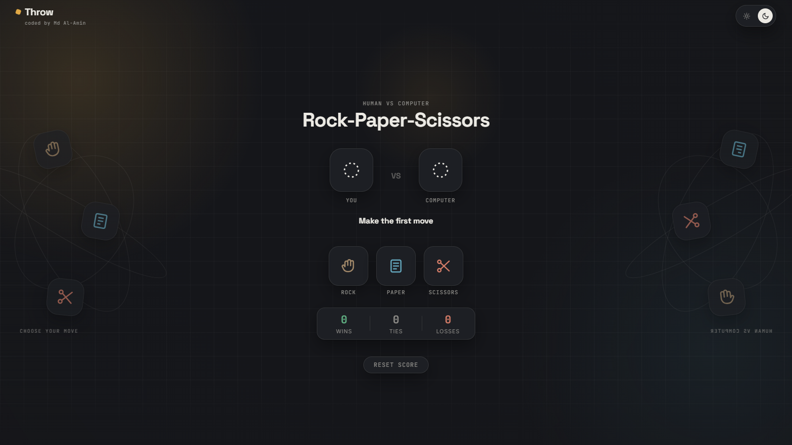

# Throw — Rock Paper Scissors Game

A lightweight, modern, and interactive Rock-Paper-Scissors game built with vanilla HTML, CSS, and JavaScript. Play directly in your browser with responsive design, keyboard controls, dynamic animations, and a light/dark theme toggle.

🌐 **Live Demo:** [https://throwhand.vercel.app/](https://throwhand.vercel.app/)

---

## 📸 Preview

---

## 🚀 Features

- **Human vs. Computer Gameplay:** Quick and responsive AI opponent with instant round outcome display.
- **Keyboard Shortcuts:** Play effortlessly using your keyboard (`R` for Rock, `P` for Paper, `S` for Scissors).
- **Light & Dark Mode:** Toggle between light and dark visual themes, with automatic detection based on system preferences.
- **Interactive UI:** Smooth 3D tilt effects on buttons, interactive mouse glow, custom SVG vector icons, and dynamic clash animations.
- **Real-time Score Tracker:** Keeps track of your wins, losses, and ties during your session with a single-click reset option.
- **Fully Responsive Layout:** Optimized for mobile, tablet, and desktop viewports with reduced motion accessibility support.

---

## 🛠️ Built With

* **HTML5** – Semantic markup and structured web accessibility elements
* **CSS3** – Custom properties, responsive flexbox layouts, CSS keyframe animations, and theme switcher logic
* **JavaScript (ES6+)** – DOM manipulation, event listeners, keyboard input handling, and game logic

---

## 🎮 How to Play

1. **Mouse / Touch:** Click or tap on **Rock**, **Paper**, or **Scissors** to choose your move.
2. **Keyboard:**
   - Press **`R`** to play **Rock**
   - Press **`P`** to play **Paper**
   - Press **`S`** to play **Scissors**
3. **Reset:** Click the **Reset score** button at the bottom to reset the win/loss counter back to zero.
