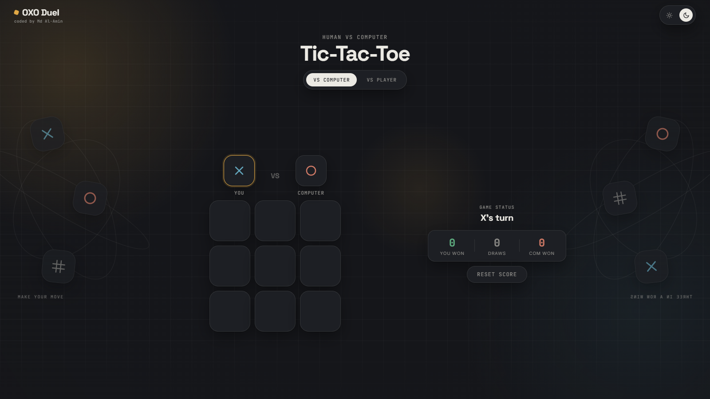

# OXODuel

A modern, responsive Tic-Tac-Toe web application built with a dark/light design system, fluid flex layouts, 3D cell micro-interactions, and real-time score tracking.

Live Demo - [**https://oxoduel.vercel.app**](https://oxoduel.vercel.app)

---

**Features**

* **Dual Play Modes**: Play against an automated minimax-inspired AI opponent or challenge a friend locally in Player vs. Player mode.
* **Responsive Layout**: Dynamically stretches and balances spacing vertically for optimal display across mobile and desktop devices.
* **Theme System**: Toggle between Dark Mode and Light Mode with persistent color variables.
* **Interactive Motion**: Custom glow cursor, 3D tile tilt on hover, and clash shake animations on moves.
* **Auto-Resetting Scoreboard**: Tracks X wins, O wins, and draws, automatically resetting when changing game modes.

---

**Built With**

* **HTML5**: Semantic document structure
* **CSS3**: Flexbox, Grid, CSS custom properties, Media Queries
* **JavaScript**: Pure Vanilla JS (ES6+)
* **Hosting**: [Vercel](https://vercel.com)
